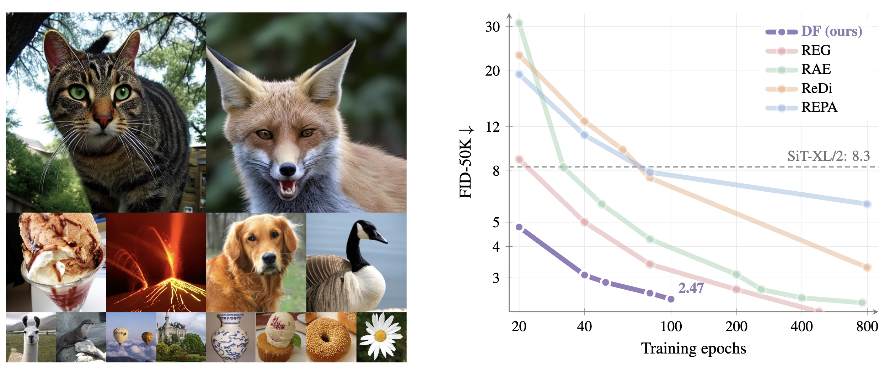

<h1 align="center">Dino Forcing Flow Models: Do not denoise what you can predict</h1>


<p align="center">
  <a href="https://arijit-hub.github.io/">Arijit Ghosh</a><sup>*</sup> &middot;
  <a href="https://lucasdegeorge.github.io/">Lucas Degeorge</a><sup>*</sup> &middot;
  <a href="https://pcouairon.github.io/">Paul Couairon</a> <br>
  <a href="https://people.eecs.berkeley.edu/~efros/">Alexei A. Efros</a> &middot;
  <a href="https://vicky.kalogeiton.info/m">Vicky Kalogeiton</a><sup>&dagger;</sup> &middot; 
  <a href="https://davidpicard.github.io/">David Picard</a><sup>&dagger;</sup>
</p>

<p align="center">
<b>IMAGINE Group @ IPP</b>, <b>VISTA Group @ IPP</b>, <b>BAIR Group @ UCB</b>
</p>

<p align="center">
  <a href="https://arijit-hub.github.io/dino_forcing"></a>
  <a href="https://arijit-hub.github.io/dino_forcing"></a>
</p>

This repository contains the official implementation of **Dino Forcing**, a method for training data efficient flow models.

The idea is simple: the model learns to denoise images while also predicting their DINO features. Because one network handles both tasks, the shared weights help each other. Since the DINO features are predicted rather than denoised, there's no need for a handcrafted noise schedule for them. Together, these make training converge much faster.

<p align="center">
  
</p>

## Setup

**Step 1**: Clone the repo.

```bash
git clone https://github.com/arijit-hub/dino_forcing.git
```

**Step 2**: Setup environment.

We use `uv` for our environment management and it makes everything super easy to use.

Download `uv` if you dont have it already
```bash
curl -LsSf https://astral.sh/uv/install.sh | sh
```

Then just sync the environment using:
```bash
uv sync
```

And that's it. You will have the environment loaded.

## Training

We use `lightning` (aka `pytorch-lightning`) for our code along with `hydra`. We provide all the configs for training our models in `src/configs`. 

To train a `SiT-B` model with Dino Forcing; just run the following command.

```bash
srun python src/train.py --config-name=SiT_B_dinoforcing
```

Make sure to change the `num_nodes` and `num_gpus` under `cluster` in the `.yaml` to support your system. Along with that change the logger name to something else and also change the batch size accordingly. Additionally, dont forget to change the path to your webdataset files for train and validation. For how to create webdataset files please consult [webdataset](https://github.com/webdataset/webdataset) repo. We want the following keys in the webdataset.

```bash
<unique_img_key>.vae_embeddings_mean_{img_size}.npy
<unique_img_key>.vae_embeddings_std_{img_size}.npy
<unique_img_key>.json
<unique_img_key>.dino_features.npy
...
```

Make sure that the `.json` has the `class_idx` key. You can take the class index mapping from `src/utils/imagenet_classes.py`. For validation wds we typically just put `1000` for the `class_idx`. 

## Evaluation

We use [`ADM`](https://github.com/openai/guided-diffusion/tree/main/evaluations) evaluation toolkit for evaluating our `SiT` models and the [`JiT`](https://github.com/LTH14/JiT/tree/main) toolkit for evaluating the `JiT` model. However, given `JiT` dont provide images in its eval stats we use the images from `ADM` for calculating the Inception Score, Precision and Recall. We uploaded the `.npz` for `JiT` in huggingface for download. You can use the following command for downloading it.

```bash
curl -L -o jit_in256_stats_with_images.npz https://huggingface.co/arijitghosh/dino_forcing/resolve/main/jit_in256_stats_with_images.npz
```


Download and put the statistics npz files in `src/utils/assets`.

We make use of [`diffevals`](https://github.com/lucasdegeorge/DiffEvals) for evaluating our script so its pretty easy.

We have uploaded all of our models in huggingface and can be downloaded from [here](https://huggingface.co/arijitghosh/dino_forcing/tree/main).

To run evaluation (for `SiT-B`), you need to select the config `SiT_B_dinoforcing`. Also download the ckpt and save it to your favourite path using the following command (you can use other ways too from huggingface!). 

```bash
curl -L -o epoch=79-step=400000.ckpt https://huggingface.co/arijitghosh/dino_forcing/resolve/main/sit_b_dinoforcing/epoch%3D79-step%3D400000.ckpt
``` 

Then run the following command.

```bash
python src/test.py --config-name=SiT_B_dinoforcing \
  trainer.logger.name=SiT_B_dinoforcing \
  cluster.num_gpu=1 \
  cluster.num_nodes=1 \
  '+metrics=['inception_fid', 'inception_is', 'inception_prdc']' \
  '+feature_extractors_for_inception_metrics=['inceptionv3']' \
  +dataset=imagenet_adm_256 \
  +return_no_images_for_real_dataloading=False \
  +batch_size=50 \
  'ckpt_path=/path/to/ckpt' \
  +num_sampling_steps=50 \
  +cfg_scale=1.0 \
  +ref_caption=imagenet_class \
  +gen_caption=imagenet_class
```

It launches and logs the values in `wandb` under the same group name as `trainer.logger.name` (if you set them the same for training and evaluation). So you can filter via Group in wandb to show the metric curves along with your loss curves if you want. 

## Generation

Generating images using pretrained model is super easy. Just use the `src/generate.py` file and set the correct checkpoint, output directory, seed, class idx and run it and it should generate and save the images in the correct folder.

## Citation
In case you find our work useful please don't forget to cite us; else we might just be sad (just kidding)!

```bibtex
article{ghoshdegeorge2026dinoforcing,
  title={Dino Forcing Flow Models: Do not denoise what you can predict},
  author={Ghosh, Arijit and Degeorge, Lucas and Couairon, Paul and A. Efros, Alexei and Kalogeiton, Vicky and Picard, David},
  shortauthor = {{Ghosh, Degeorge et al.}},
  journal={arXiv},
  year={2025}
}
```

It would be super nice if you use this citation and see that it says `Ghosh, Degeorge et al.` if you are using an expanded citation format!

## Codebase Acknowledgement

The codebase is heavily inspired from [DiT](https://github.com/facebookresearch/dit), [SiT](https://github.com/willisma/SiT), [REPA](https://github.com/sihyun-yu/REPA), [TREAD](https://github.com/CompVis/tread), [RAE](https://github.com/bytetriper/RAE), [JiT](https://github.com/LTH14/JiT) and [CAD](https://github.com/nicolas-dufour/CAD/tree/master).

## Acknowledgement
We would like to thank Nicolas Dufour, Felix Krause, Zeynep Sonat Baltacı, Gatien Chenu, Fei Meng, Julie Mordacq, Yohann Perron, Alexandros Benetatos, Loic Landrieu, Tristan Quétin, Tom Ravaud, Louis Geist and Lucas Ventura for many cool discussions and feedbacks throughout the project. Thee paper was granted compute access to the HPC resources of IDRIS under the allocations 2025-A0181016194, 2025-AD011015436 2026-A0201017545 and 2026-AD011015594R2 made by GENCI.